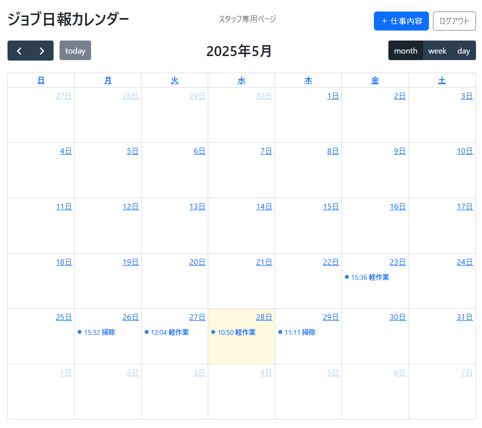
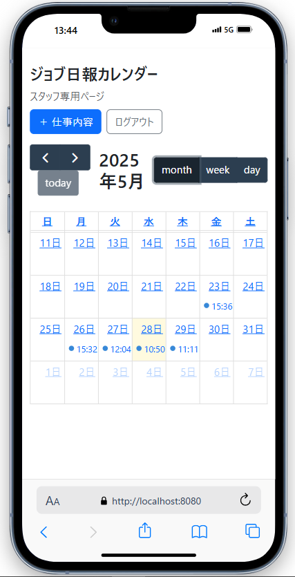
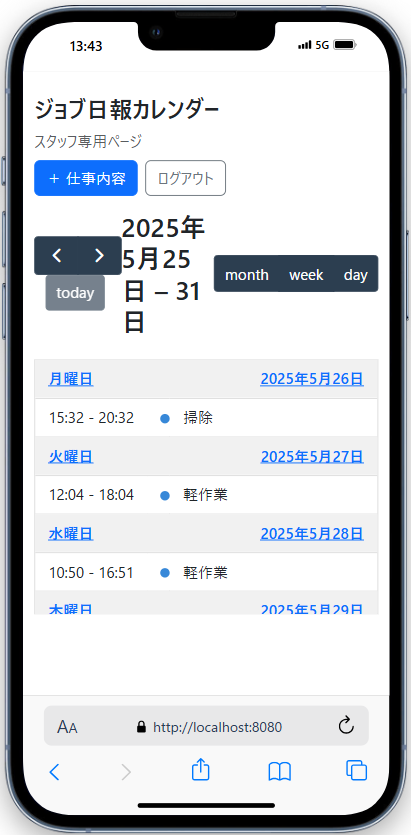

# 📝 ジョブ日報アプリ（Job Report App）

本アプリは、福祉・就労支援の現場における**日報（作業記録）を効率よく管理・共有**するためのWebシステムです。  
支援スタッフと利用者・保護者間の情報共有を円滑にし、現場業務の可視化・効率化を目的としています。

---

## 📌 システム概要

### 🎯 目的（Why）

- 🕒 支援スタッフの日報記録業務の効率化  
- 🤝 利用者・保護者との情報共有による安心感の提供  
- 📊 月次報告書作成の簡略化  

### 👥 想定ユーザー（Who）

| ユーザー区分           | 主な役割                 | 利用可能な機能                              |
|------------------------|--------------------------|---------------------------------------------|
| スタッフ（`ROLE_STAFF`）     | 日報の作成・編集・管理        | 日報の登録・編集・削除、一覧表示、コメント投稿      |
| 利用者・保護者（`ROLE_USER`） | 自身の記録の閲覧・コメント返信 | 日報の閲覧、自身のコメント編集・削除              |

### ⚙️ 実装済み機能（What）

| 機能名                | 概要                                                             |
|-----------------------|------------------------------------------------------------------|
| ログイン機能           | Spring Security による認証認可機能（権限ごとに表示・操作を制御）          |
| 日報の登録・管理        | 作業内容、対象利用者、時間、備考を含む日報を作成・編集・削除可能             |
| カレンダー表示          | FullCalendar による月表示・週表示切替と、日報イベントの視覚化             |
| コメント投稿・返信機能   | 各日報に対してコメントを投稿・返信可（自身のコメントは編集・削除可能）       |
| 日報詳細のモーダル表示   | 日報をクリックで詳細表示（モーダル形式）                                |
| ロール別アクセス制御     | `ROLE_STAFF`は全日報管理可、`ROLE_USER`は自身の記録のみ閲覧可            |

### 🧪 今後の拡張予定（ToDo）

- 📄 PDF / CSV による月次日報レポート出力機能  
- 📈 管理者ダッシュボード（統計情報の可視化）  
- 🔔 通知機能（コメント返信や日報更新の通知）

---

## 📷 使用シナリオ（ユースケース例）

1. スタッフが本日の訓練内容や支援状況を日報として記録  
2. 利用者や保護者がスマートフォンから日報を閲覧  
3. コメント欄でコミュニケーション（例：「いつもありがとうございます！」）  
4. 月末、管理者がCSV形式で出力し、報告書作成に活用  

---

## 💻 使用技術

| 技術 | 内容 |
|------|------|
| Java | バックエンド開発言語 |
| Spring Boot | Webアプリケーションフレームワーク |
| H2 Database | 開発用インメモリデータベース |
| Thymeleaf | HTMLテンプレートエンジン |
| JavaScript | クライアントサイド動作（FullCalendar等） |
| HTML / CSS | レイアウトおよびデザイン |
| Maven | 依存関係管理 |
| Eclipse | 開発環境 |

---

## 🖼 画面イメージ

- PC：カレンダー画面  
  

- モバイル：カレンダー画面  
  

- モバイル：リスト画面  
  

---

## 📁 プロジェクト構成

job-report/
├── src/
│ └── main/
│ ├── java/com/example/demo/
│ │ ├── controller/ # コントローラ（ルーティング）
│ │ ├── dto/ # データ転送オブジェクト
│ │ ├── model/ # エンティティ（User, Event, Commentなど）
│ │ ├── repository/ # JPAリポジトリ
│ │ ├── service/ # ビジネスロジック層
│ │ └── DemoApplication.java # メイン起動クラス
│ └── resources/
│ ├── static/ # 静的ファイル（JS・CSS）
│ ├── templates/ # HTMLテンプレート（Thymeleaf）
│ ├── application.properties
│ └── schema.sql # 初期DB定義（任意）
├── pom.xml # Maven設定
└── README.md # 本ファイル

---

## 🚀 ローカル実行手順

1. Eclipse にて本プロジェクトを **Mavenプロジェクトとしてインポート**  
2. `DemoApplication.java` を実行  
3. ブラウザで [http://localhost:8080](http://localhost:8080) にアクセス  

---

## 🛡️ その他備考

- 開発中のため、H2データベースを採用しています。  
- 初期ユーザー情報等は `application.properties` をご確認ください。  
- セキュリティ設定は `SecurityConfig.java` に記載しています。  

---

## 🔗 外部リンク

- 🎨 [Figma画面設計](https://www.figma.com/design/uTaz5c1waDwcKanW8nIyZZ/%E3%82%B8%E3%83%A7%E3%83%96%E6%97%A5%E5%A0%B1_UI%E8%A8%AD%E8%A8%88?node-id=0-1&p=f&t=MONbQoYwMV5EWNeT-0)  
- 💻 [GitHubリポジトリ](https://github.com/haranotatsuo/job-report.git)  
- 🗺️ [画面遷移図（PNG）](./images/画面遷移図.png)  
- 📘 [ER図（PNG）](./images/ER.png)
